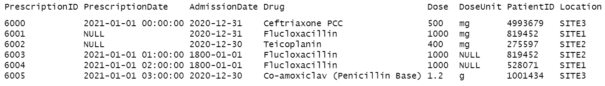

<!-- README.md is generated from README.Rmd. Please edit that file -->

```{r setup, include=FALSE}
knitr::opts_chunk$set(echo = TRUE)
```

# daiquiri

<!-- badges: start -->
[](https://github.com/ropensci/daiquiri/actions)
[](https://app.codecov.io/gh/ropensci/daiquiri?branch=master)
[](https://www.repostatus.org/#active)
[](https://github.com/ropensci/software-review/issues/535)
<!-- badges: end -->

The daiquiri package generates data quality reports that enable quick visual review of temporal shifts in record-level data. Time series plots showing aggregated values are automatically created for each data field (column) depending on its contents (e.g. min/max/mean values for numeric data, no. of distinct values for categorical data), as well as overviews for missing values, non-conformant values, and duplicated rows.

Essentially, it takes input such as this:



And outputs this:


The resulting html reports are shareable and can contribute to forming a transparent record of the entire analysis process. It is designed with electronic health records in mind, but can be used for any type of record-level temporal data.

## Why should I use it?

Large routinely-collected datasets are increasingly being used in research. However, given their data are collected for operational rather than research purposes, there is a greater-than-usual need for them to be checked for data quality issues before any analyses are conducted. Events occurring at the institutional level such as software updates, new machinery or processes can cause temporal artefacts that, if not identified and taken into account, can lead to biased results and incorrect conclusions. For example, the figures below show real data from a large hospital in the UK, and how it has changed over time.


The first figure  shows the percentage of missing values in the 'Duration' field of a dataset containing antibiotic prescriptions, and the second figure shows the mean value of all laboratory tests checking for levels of 'creatinine' in the blood. As you can see, there are points in time where these values shift up or down suddenly and unnaturally, indicating that something changed in the way the data was collected or processed. A careful researcher needs to take these sudden changes into account, particularly if comparing or combining the data before and after these 'change points'.

While these checks should theoretically be conducted by the researcher at the initial data analysis stage, in practice it is unclear to what extent this is actually done, since it is rarely, if ever, reported in published papers. With the increasing drive towards greater transparency and reproducibility within the scientific community, this essential yet often-overlooked part of the analysis process will inevitably begin to come under greater scrutiny. The daiquiri package helps researchers conduct this part of the process more thoroughly, consistently and transparently, hence increasing the quality of their studies as well as trust in the scientific process.

## Installation

```{r, eval = FALSE}
# install the latest release from CRAN
install.packages("daiquiri")

# or install the development version from rOpenSci
install.packages("daiquiri", repos = "https://ropensci.r-universe.dev")

```

## Usage

```{r}
library(daiquiri)

# load delimited file into a data.frame without doing any datatype conversion
path <- system.file("extdata", "example_prescriptions.csv", package = "daiquiri")
raw_data <- read_data(path, show_progress = FALSE)

head(raw_data)

# specify the type of data expected in each column of the data.frame
fts <- field_types(
  PrescriptionID = ft_uniqueidentifier(),
  PrescriptionDate = ft_timepoint(),
  AdmissionDate = ft_datetime(includes_time = FALSE),
  Drug = ft_freetext(),
  Dose = ft_numeric(),
  DoseUnit = ft_categorical(),
  PatientID = ft_ignore(),
  Location = ft_categorical(aggregate_by_each_category = TRUE)
)
```

```{r, eval = FALSE}
# create a report in the current directory
daiq_obj <- daiquiri_report(
  raw_data,
  field_types = fts
)
```

An [example report](https://ropensci.github.io/daiquiri/misc/example_data_report.html) is available from the [package website](https://ropensci.github.io/daiquiri/index.html).

More detailed guidance can be found in the [walkthrough vignette](https://ropensci.github.io/daiquiri/articles/daiquiri.html):

```{r, eval = FALSE}
vignette("daiquiri", package = "daiquiri")
```

## How to cite this package

Please remember to update the version number to match the version you used.

> Quan TP (2022). daiquiri: Data quality reporting for temporal datasets. R package version v1.0.0. Zenodo. https://doi.org/10.5281/zenodo.6334341. URL: https://github.com/ropensci/daiquiri

## Acknowledgements

This work was supported by the National Institute for Health Research Health Protection Research Unit (NIHR HPRU) in Healthcare Associated Infections and Antimicrobial Resistance at the University of Oxford in partnership with Public Health England (PHE) (NIHR200915), and by the NIHR Oxford Biomedical Research Centre.


## Contributing to this package

Please report any bugs or suggestions by opening a [github issue](https://github.com/ropensci/daiquiri/issues).

Please note that this package is released with a [Contributor Code of Conduct](https://ropensci.org/code-of-conduct/). 
By contributing to this project, you agree to abide by its terms.
