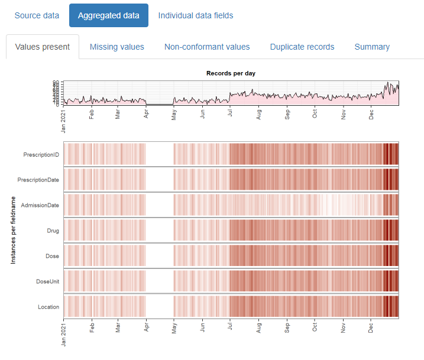
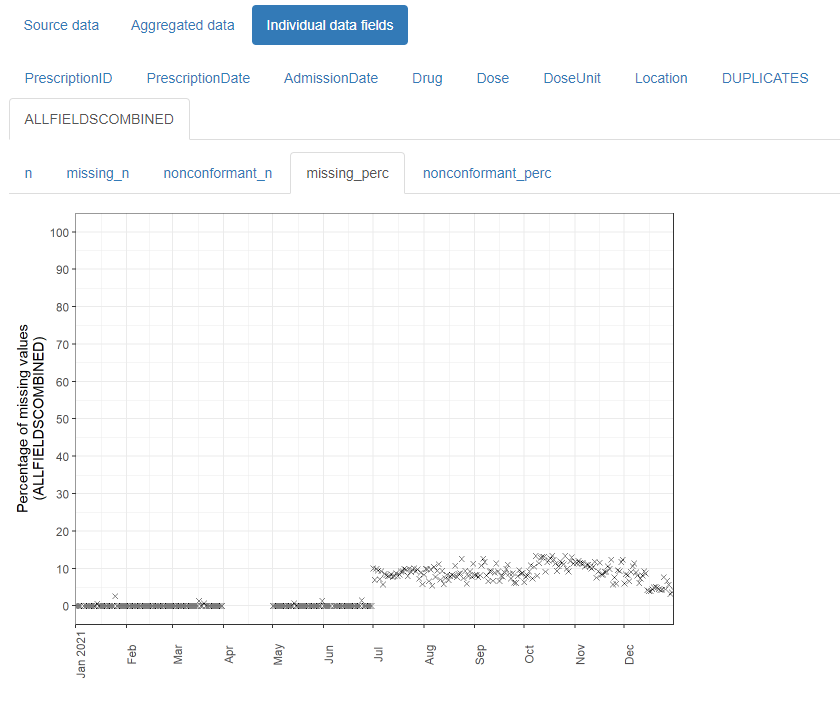

<!-- README.md is generated from README.Rmd. Please edit that file -->

# daiquiri

<!-- badges: start -->

[](https://github.com/phuongquan/daiquiri/actions)
[](https://app.codecov.io/gh/phuongquan/daiquiri?branch=master)
[](https://www.repostatus.org/#active)
<!-- badges: end -->

The daiquiri package generates data quality reports that enable quick
visual review of temporal shifts in record-level data. Time series plots
showing aggregated values are automatically created for each data field
(column) depending on its contents (e.g. min/max/mean values for numeric
data, no. of distinct values for categorical data), as well as overviews
for missing values, non-conformant values, and duplicated rows.

Essentially, it takes input such as this:


And outputs this:



The resulting html reports are shareable and can contribute to forming a
transparent record of the entire analysis process. It is designed with
electronic health records in mind, but can be used for any type of
record-level temporal data.

## Why should I use it?

Large routinely-collected datasets are increasingly being used in
research. However, given their data are collected for operational rather
than research purposes, there is a greater-than-usual need for them to
be checked for data quality issues before any analyses are conducted.
Events occurring at the institutional level such as software updates,
new machinery or processes can cause temporal artefacts that, if not
identified and taken into account, can lead to biased results and
incorrect conclusions. For example, the figures below show real data
from a large hospital in the UK, and how it has changed over time.


The first figure shows the percentage of missing values in the
‘Duration’ field of a dataset containing antibiotic prescriptions, and
the second figure shows the mean value of all laboratory tests checking
for levels of ‘creatinine’ in the blood. As you can see, there are
points in time where these values shift up or down suddenly and
unnaturally, indicating that something changed in the way the data was
collected or processed. A careful researcher needs to take these sudden
changes into account, particularly if comparing or combining the data
before and after these ‘change points’.

While these checks should theoretically be conducted by the researcher
at the initial data analysis stage, in practice it is unclear to what
extent this is actually done, since it is rarely, if ever, reported in
published papers. With the increasing drive towards greater transparency
and reproducibility within the scientific community, this essential yet
often-overlooked part of the analysis process will inevitably begin to
come under greater scrutiny. The daiquiri package helps researchers
conduct this part of the process more thoroughly, consistently and
transparently, hence increasing the quality of their studies as well as
trust in the scientific process.

## Installation

The intention is to make daiquiri available in CRAN but until then, you
can install the current development version from GitHub:

``` r
# install.packages("devtools")
devtools::install_github("phuongquan/daiquiri", build_vignettes = TRUE)
```

## Usage

``` r
library(daiquiri)

# load delimited file into a data.frame without doing any datatype conversion
path <- system.file("extdata", "example_prescriptions.csv", package = "daiquiri")
rawdata <- read_data(path, showprogress = FALSE)

head(rawdata)
```

    ## # A tibble: 6 × 8
    ##   PrescriptionID PrescriptionDate   AdmissionDate Drug  Dose  DoseUnit PatientID
    ##   <chr>          <chr>              <chr>         <chr> <chr> <chr>    <chr>    
    ## 1 6000           2021-01-01 00:00:… 2020-12-31    Ceft… 500   mg       4993679  
    ## 2 6001           NULL               2020-12-31    Fluc… 1000  mg       819452   
    ## 3 6002           NULL               2020-12-30    Teic… 400   mg       275597   
    ## 4 6003           2021-01-01 01:00:… 2020-12-31    Fluc… 1000  NULL     819452   
    ## 5 6004           2021-01-01 02:00:… 2020-12-20    Fluc… 1000  NULL     528071   
    ## 6 6005           2021-01-01 03:00:… 2020-12-30    Co-a… 1.2   g        1001434  
    ## # … with 1 more variable: Location <chr>

``` r
# specify the type of data expected in each column of the data.frame
fts <- fieldtypes(
    PrescriptionID = ft_uniqueidentifier(),
    PrescriptionDate = ft_timepoint(),
    AdmissionDate = ft_datetime(includes_time = FALSE),
    Drug = ft_freetext(),
    Dose = ft_numeric(),
    DoseUnit = ft_categorical(),
    PatientID = ft_ignore(),
    Location = ft_categorical(aggregate_by_each_category=TRUE)
)
```

``` r
# create a report in the current directory
daiqobj <- create_report(
  rawdata,
  fieldtypes = fts
)
```

An [example
report](https://phuongquan.github.io/daiquiri/misc/example_prescriptions_report.html)
is available from the [package
website](https://phuongquan.github.io/daiquiri/index.html).

More detailed guidance can be found in the [walkthrough
vignette](https://phuongquan.github.io/daiquiri/articles/daiquiri.html):

``` r
vignette("daiquiri", package = "daiquiri")
```

## How to cite this package

Please remember to update the version number to match the version you
used.

> Quan TP (2022). daiquiri: Data quality reporting for temporal
> datasets. R package version v0.7.0. Zenodo.
> <https://doi.org/10.5281/zenodo.6334341>. URL:
> <https://github.com/phuongquan/daiquiri>

## Acknowledgements

This work was supported by the National Institute for Health Research
Health Protection Research Unit (NIHR HPRU) in Healthcare Associated
Infections and Antimicrobial Resistance at the University of Oxford in
partnership with Public Health England (PHE) (NIHR200915), and by the
NIHR Oxford Biomedical Research Centre.
