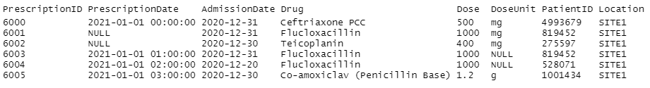
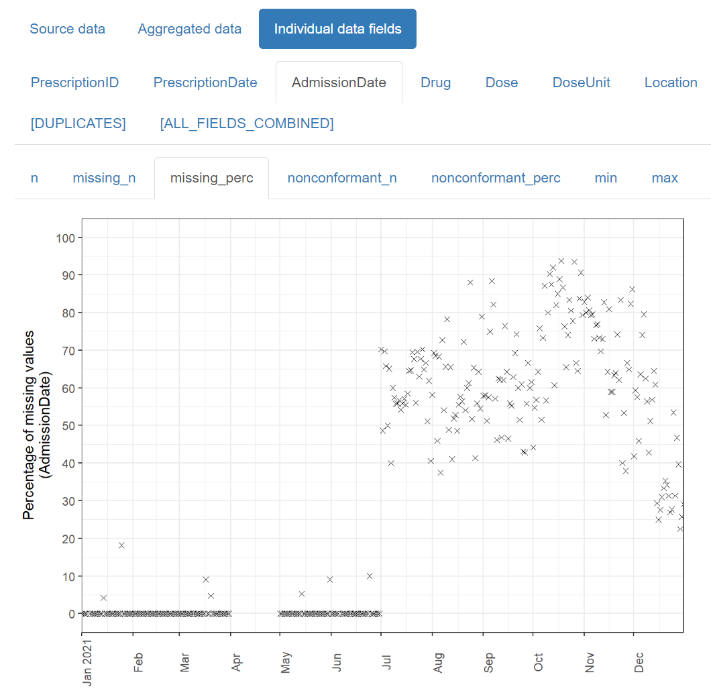
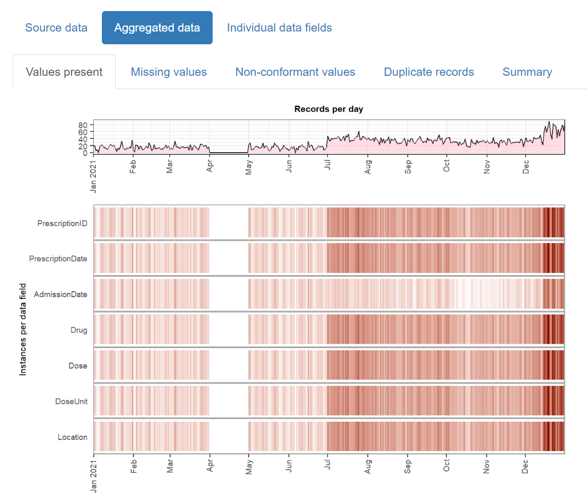

# Summary

The `daiquiri` R package generates data quality reports that enable quick visual
review of temporal shifts in record-level data. It is designed with electronic
health records in mind, but can be used for any type of record-level temporal
data (i.e. tabular data where each row represents a single "event", one column
contains the "event date", and other columns contain any associated values for
the event, see \autoref{fig:example_prescriptions_head} for an example).

The package automatically creates time series plots showing aggregated values
for each data field (column) depending on its contents (e.g. min/max/mean values
for numeric data, no. of distinct values for categorical data), see
\autoref{fig:example_prescriptions_individual}, as well as
overviews for missing values, non-conformant values, and duplicated rows, see
\autoref{fig:example_prescriptions_overview}.

{ width=80% }

{ width=80% }

The resulting html reports are shareable and can contribute to forming a
transparent record of the entire analysis process.

# Statement of need

Large routinely-collected datasets are increasingly being used in research.
However, given their data are collected for operational rather than research
purposes, there is a greater-than-usual need for them to be checked for data
quality issues before any analyses are conducted. Events occurring at the
institutional level such as software updates, new machinery or processes can
cause temporal artefacts that, if not identified and taken into account, can
lead to biased results and incorrect conclusions.

For example,
\autoref{fig:bchem_creatinine_mean} shows the mean value of all
laboratory tests checking for levels of creatinine in the blood, from a large
hospital group in the UK. As you can see, there are points in time where these
values shift up or down suddenly and unnaturally, indicating that something
changed in the way the data was collected or processed. A careful researcher
needs to take these sudden changes into account, particularly if comparing or
combining the data before and after these 'change points'.

{ width=80% }

While these checks should theoretically be conducted by the researcher at the
initial data analysis stage, in practice it is unclear to what extent this is
actually done, since it is rarely, if ever, reported in published papers. With
the increasing drive towards greater transparency and reproducibility within the
scientific community, this essential yet often-overlooked part of the analysis
process will inevitably begin to come under greater scrutiny. The `daiquiri`
package helps researchers conduct this part of the process more thoroughly,
consistently and transparently, hence increasing the quality of their studies as
well as trust in the scientific process.

There are a number of existing R packages which generate reports that provide an
overview of a dataset's contents, such as `dataReporter` (formerly `dataMaid`)
[@datamaid2019], `smartEDA` [@smarteda2019], and `dataquieR` [@dataquier2021]. 
In these packages, summary statistics are calculated
across all rows in the dataset, or perhaps stratified by a categorical field. In
contrast, `daiquiri` focuses on how these summary statistics may change over the
time scale of the dataset, which can reveal data quality issues that might otherwise be
missed when using these other packages.

# Acknowledgements

This package was created as part of a PhD project, supervised by A. Sarah Walker, Tim Peto, Martin Landray, and Ben Lacey.

I would like to thank the [rOpenSci](https://ropensci.org/) team for their valuable input.

This work was supported by the National Institute for Health Research Health Protection Research Unit (NIHR HPRU) in Healthcare Associated Infections and Antimicrobial Resistance at the University of Oxford in partnership with Public Health England (PHE) (NIHR200915), and by the NIHR Oxford Biomedical Research Centre. 

# References
