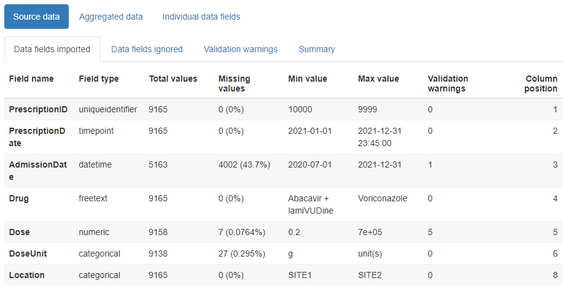
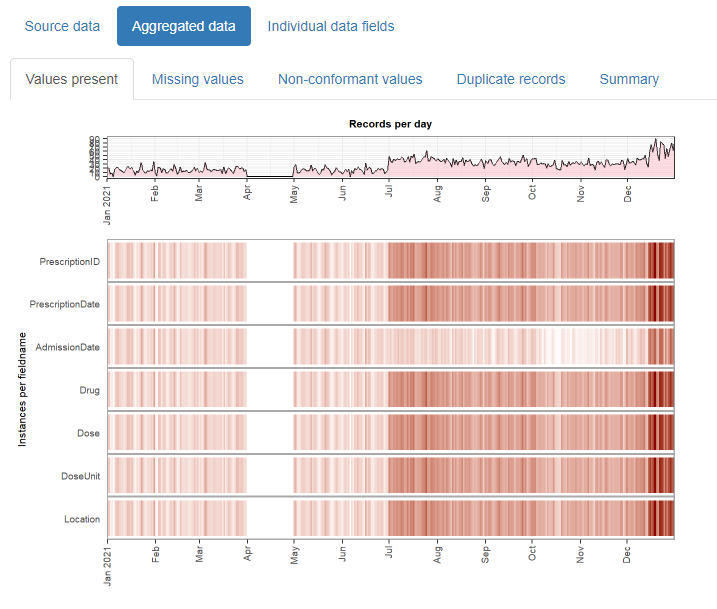
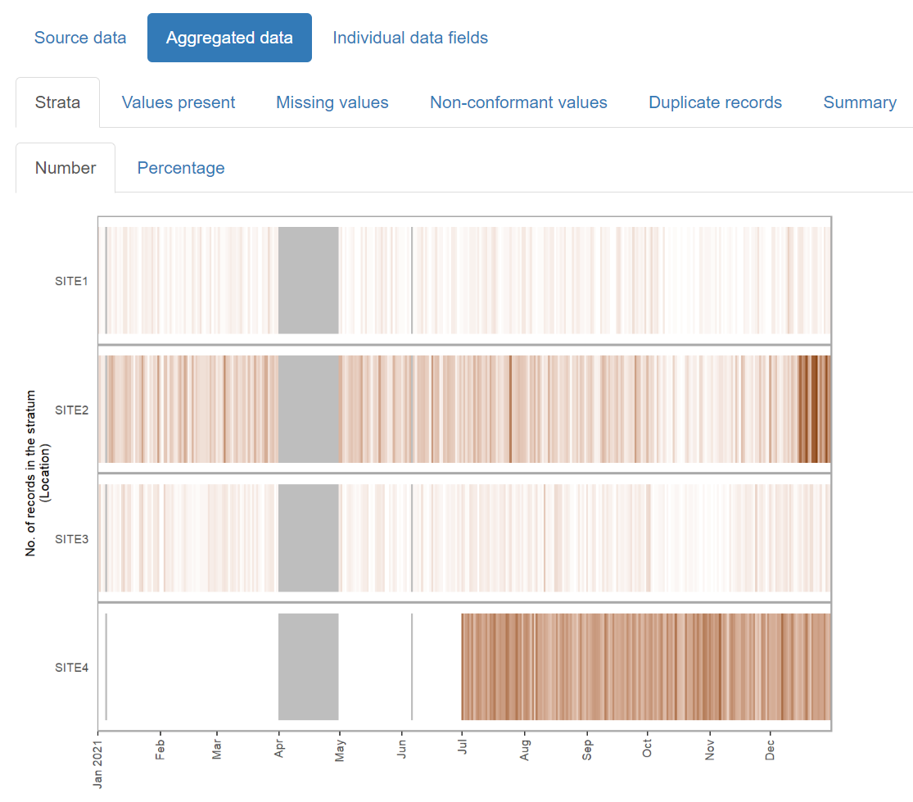
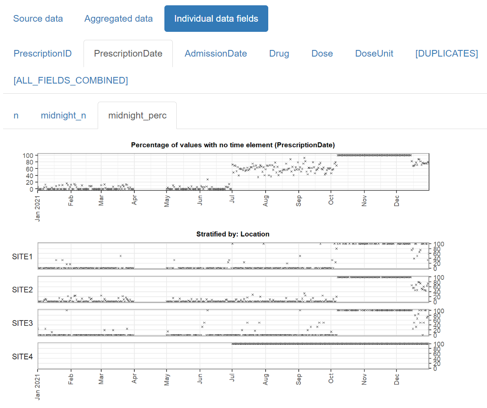

```{r, include = FALSE}
knitr::opts_chunk$set(
  collapse = TRUE,
  comment = "#>"
)

# show all columns when printing tibbles
options(tibble.width = Inf)

# restrict threads for CRAN compliance
dt_threads <- data.table::getDTthreads()
data.table::setDTthreads(1)
```

This vignette demonstrates how to use this package to generate an html report that allows you to quickly review any changes in a temporal dataset’s values over time.

## Data format

Data must be in tabular format, as a data frame. Each row should represent a single "event" such as a visit to hospital or a medical test result or a drug prescription. One column must contain the "event date" (aka "timepoint") for the row, with further columns containing any associated values for the event, such as the type of visit, or the name of the medical test, or the quantity of the drug prescribed.

In order for the package to detect any non-conformant values in numeric or datetime fields, these should be present in the data frame in their raw character format. A function called `read_data()` is supplied to assist with this, and will read rectangular data from a text file automatically as character type.

Dates are expected to be in the format `YYYY-MM-DD` or `YYYY-MM-DD HH:MM:SS`, though a range of other date formats can also be accepted (see later). User-specified locales are not currently supported.


**Example:**

The `example_prescriptions` dataset is provided with this package as a csv file, and contains (synthetic) examples of antibiotic prescriptions given in a hospital over a period of a year, with one row per prescription. It contains 8 columns:

* PrescriptionID - the uniqueidentifier for the row
* PrescriptionDate - The date the prescription was given
* AdmissionDate - The date the patient was admitted to the hospital
* Drug - The name of the antibiotic prescribed
* Dose - The size of the dose prescribed
* DoseUnit - The units for the dose prescribed
* PatientID - A unique identifier for the patient
* Location - The location of the patient

There are some missing values which are represented by the string 'NULL' and some dates with the value '1800-01-01'. String values that should be treated as missing values can be specified  using the `na` parameter, either per column or for the entire dataset. 

```{r}
# first, attach the package if you haven't already
library(daiquiri)

# this is where the example file is located
path <- system.file("extdata", "example_prescriptions.csv", package = "daiquiri")

# load the data into a data.frame without doing any datatype conversion
example_prescriptions <- read_data(
  path,
  delim = ",",
  col_names = TRUE,
  show_progress = FALSE
)

head(example_prescriptions)
```

## Specification of data field types

You must specify what type of data is expected in each column, e.g. a date, a number, a nominal category. The package will use this information to calculate the number of values that are not of the expected type, and to decide which summary functions to use for the time series'.

One and only one column must be chosen to be the "timepoint" field (though you could run the package again using a different column as the timepoint field if you so choose). This column will be used as the independent time variable on the x-axis of each time series plot.

Here is a list of the possible field types for the columns. Different time series will be generated depending on the type of field. All types will have time series generated for the number of values present, as well as the number and percentage of missing values.

* `ft_timepoint()` - identifies the data field which should be used as the independent time variable (and will form the x-axis of any time series plots). There should be one and only one of these specified. The number of values present in this field is equivalent to the number of records in the data set (after duplicates have been removed). By default, time series will also be created for the number and percentage of values which do not contain a time portion, though this can be switched off if the `includes_time` parameter is set to `FALSE` (e.g. if you already know in advance that there are no time portions in any of the values). NOTE: Time series' are not created for missing values as they cannot be assigned to a date. Instead, the total number of missing values is included in the summary table.
* `ft_uniqueidentifier()` - identifies data fields which contain a (usually computer-generated) identifier for an entity, e.g. a patient. It does not need to be unique within the dataset. Values are treated as strings, with additional time series created for min_length, max_length, and mean_length of the string.
* `ft_categorical()` - identifies data fields which should be treated as categorical. Values are treated as strings. Additional time series are created for the number of "distinct" values, and if the `aggregate_by_each_category` parameter is set to `TRUE`, further time series will be created for the number and percentage of values within each distinct subcategory value.
* `ft_numeric()` - identifies data fields which contain numeric values that should be treated as continuous. Additional time series are created for the min, max, mean, and median value, and and the number and percentage of non-conformant values.
* `ft_datetime()` - identifies data fields which contain date (and optionally time) values that should be treated as continuous. Additional time series are created for the min, max, and mean value, and and the number and percentage of non-conformant values. By default, time series will also be created for the number and percentage of values which do not contain a time portion, though this can be switched off if the `includes_time` parameter is set to `FALSE` (e.g. if you already know in advance that there are no time portions in any of the values).
* `ft_freetext()` - identifies data fields which contain free text values. Only presence/missingness will be evaluated.
* `ft_simple()` - identifies data fields where you only want presence/missingness to be evaluated (but which are not necessarily free text).
* `ft_ignore()` - identifies data fields which should be ignored. These will not be loaded.

Lastly, a number of time series will be generated for the dataset as a whole, namely:

* The number and percentage presence of duplicate records (i.e. where the entire row is the same as another row in the dataset)
* The total number of values present across all data fields
* The total number and percentage of missing and of non-conformant values (where relevant) across all data fields

NOTES:

The `ft_timepoint()` and `ft_datetime()` field types accept a `format` parameter for when the values in the column are not in `YYYY-MM-DD` or `YYYY-MM-DD HH:MM:SS` format. These must follow the `col_datetime` format specifications from the `readr` package, e.g. "%d/%m/%Y". When a format is supplied, it must match the complete string. User-specified locales are not currently supported.

If your data is already aggregated (e.g. one column contains a date and the other columns contain the number of inpatient admissions, outpatient appointments, and emergency department attendances on that date), you can still use this package if you restrict to the `ft_timepoint()`, `ft_numeric()`, and `ft_simple()` field types.

**Example:**

For the `example_prescriptions` dataset above, we will use the PrescriptionDate as the timepoint field, and specify the other columns as follows:

```{r}
# set up a field_types specification for use later
fts <- field_types(
  PrescriptionID = ft_uniqueidentifier(),
  PrescriptionDate = ft_timepoint(),
  AdmissionDate = ft_datetime(includes_time = FALSE, na = "1800-01-01"),
  Drug = ft_freetext(),
  Dose = ft_numeric(),
  DoseUnit = ft_categorical(),
  PatientID = ft_ignore(),
  Location = ft_categorical(aggregate_by_each_category = TRUE)
)
```

This is just one of many different possible choices, for example another option could be to use the AdmissionDate as the timepoint field instead, and set the Drug column to be categorical. It is up to you to decide which set of time series you want to be created for each column.

TIP: If you have a lot of columns in your dataset you can use the `template_field_types()` function to print a template specification to the console that you can copy and edit. Alternatively, if your columns are almost all of the same type you can use the `.default_field_type` parameter for any columns not explicitly specified in `field_types()`.


## Generating a data quality report

The simplest way to create a data quality report is to use the `daiquiri_report()` function. If successful, the function will return a list containing information relating to the supplied parameters as well as the resulting `daiquiri_source_data` and `daiquiri_aggregated_data` objects, which can be reused to create further reports without needing to run everything all over again.

At this point we need to decide what level of aggregation granularity we want to use. Options are daily/weekly/monthly/quarterly/yearly. Smaller aggregation granularities (e.g. day or week) will provide more detail, but if your data is sparser you might want to use a larger granularity. Time series will be created according to the specified field types, by aggregating the values for all records whose timepoint value lies within the relevant day/week/month etc.

We also need to decide where to save the report, and optionally specify a filename (excluding file extension). The filename can only contain alphanumeric, `-` and `_` characters. If a filename is not supplied, one will be automatically generated. We can also optionally specify a short description for the dataset, which will appear on the report.

If you specify a log directory, details of all the processing steps will be saved into a text file.

You can choose to override the existing column names in the dataframe with those in the `field_types()` specification by setting the `override_column_names` parameter to `TRUE`, in which case they must be specified in the correct order. If `override_column_names = FALSE` (the default) then the names in the `field_types()` specification must match exactly to those in the dataframe.

**Example:**

For the `example_prescriptions` dataset above, we will set the aggregation granularity to `day`, and save a report in the current directory.

```{r, include=FALSE}
# quietly test can create the report from an rmd but show the code in the next chunk in the vignette
daiq_obj <- daiquiri_report(
  df = example_prescriptions,
  field_types = fts,
  override_column_names = FALSE,
  na = c("", "NULL"),
  dataset_description = "Example prescription data",
  aggregation_timeunit = "day",
  report_title = "daiquiri data quality report",
  save_directory = tempdir(),
  save_filename = "example_prescriptions_report",
  show_progress = FALSE,
  log_directory = NULL
)
# clean up
file.remove(daiq_obj$report_filename)
```

```{r, eval=FALSE}
daiq_obj <- daiquiri_report(
  df = example_prescriptions,
  field_types = fts,
  override_column_names = FALSE,
  na = c("", "NULL"),
  dataset_description = "Example prescription data",
  aggregation_timeunit = "day",
  report_title = "daiquiri data quality report",
  save_directory = ".",
  save_filename = "example_prescriptions_report",
  show_progress = TRUE,
  log_directory = NULL
)
```

## Contents of the report

The html reports created by this package can be opened in a browser and/or attached to an email, and contain three main tabs:

### Source data

This contains child tabs which provide an overall summary of the data imported, plus a complete list of validation warnings (such as any values identified as non-conformant)



### Aggregated data

This contains child tabs which display plots showing overall numbers of records, missing values, non-conformant values, and duplicate records per timepoint, across the dataset as a whole. Fields and timepoints where these values are not applicable are coloured in grey.



### Individual data fields

This contains two levels of child tabs. The first level consists of one tab per data field in the dataset. Within each data field tab, there is a further set of child tabs displaying a plot for each time series created.


## Creating a stratified report

When the data consists of records from a number of distinct sources (e.g. different hospital sites), or can be partitioned in another meaningful way (e.g. elective versus emergency hospital admissions), you can create a stratified report which allows you to inspect the data within each of the subcategories alongside each other.

**Example:**

For the same `example_prescriptions` dataset above, we can specify that we want to stratify the report according to hospital site, by setting the Location field to the `ft_strata()` field type:

```{r}
fts <- field_types(
  PrescriptionID = ft_uniqueidentifier(),
  PrescriptionDate = ft_timepoint(),
  AdmissionDate = ft_datetime(includes_time = FALSE, na = "1800-01-01"),
  Drug = ft_freetext(),
  Dose = ft_numeric(),
  DoseUnit = ft_categorical(),
  PatientID = ft_ignore(),
  Location = ft_strata()
)
```

Then we can create a report the same way as usual.

```{r, eval=FALSE}
daiq_obj <- daiquiri_report(
  df = example_prescriptions,
  field_types = fts,
  override_column_names = FALSE,
  na = c("", "NULL"),
  dataset_description = "Example prescription data",
  aggregation_timeunit = "day",
  report_title = "daiquiri data quality report - stratified",
  save_directory = ".",
  save_filename = "example_prescriptions_report_stratified",
  show_progress = TRUE,
  log_directory = NULL
)
```


### Aggregated data

In the Strata tab, you can see the number and the percentage of records belonging to each stratum over time. Also, the tabs for Values present, Missing values, and Non-conformant values, are further split into child tabs - one covering the whole dataset plus one for each stratum.



### Individual data fields

These tabs now show multiple time series aligned into a single plot, one time series covering all the records plus one for each stratum.




## Advanced usage details

The simplest way to use this package is to use the `daiquiri_report()` function as described above, which loads the data, aggregates it, and generates a report all in one go. However, if you have a very large dataset or if you want to create reports for multiple aggregation granularities without re-loading the data each time, you may prefer to do this in stages. Here is an example of how to use the intermediate functions and objects to achieve this. NOTE: if you want to change the `field_types()` specification then the data will need to be re-loaded.

```{r, eval=FALSE}
# load your dataset into a source_data object
prescriptions_source_data <- prepare_data(
  example_prescriptions,
  fieldtypes = fts,
  na = c("", "NULL")
)

# aggregate the source_data object by desired granularity
prescriptions_byday <- aggregate_data(
  prescriptions_source_data,
  aggregation_timeunit = "day"
)

# aggregate the same source_data object by a different granularity
prescriptions_byweek <- aggregate_data(
  prescriptions_source_data,
  aggregation_timeunit = "week"
)

# generate and save the reports
report_data(
  source_data = prescriptions_source_data,
  aggregated_data = prescriptions_byday,
  report_title = "Daily prescriptions",
  save_directory = ".",
  save_filename = "example_prescriptions_byday"
)

report_data(
  source_data = prescriptions_source_data,
  aggregated_data = prescriptions_byweek,
  report_title = "Weekly prescriptions",
  save_directory = ".",
  save_filename = "example_prescriptions_byweek"
)
```

```{r, include = FALSE}
# restore thread setting
data.table::setDTthreads(dt_threads)
```


